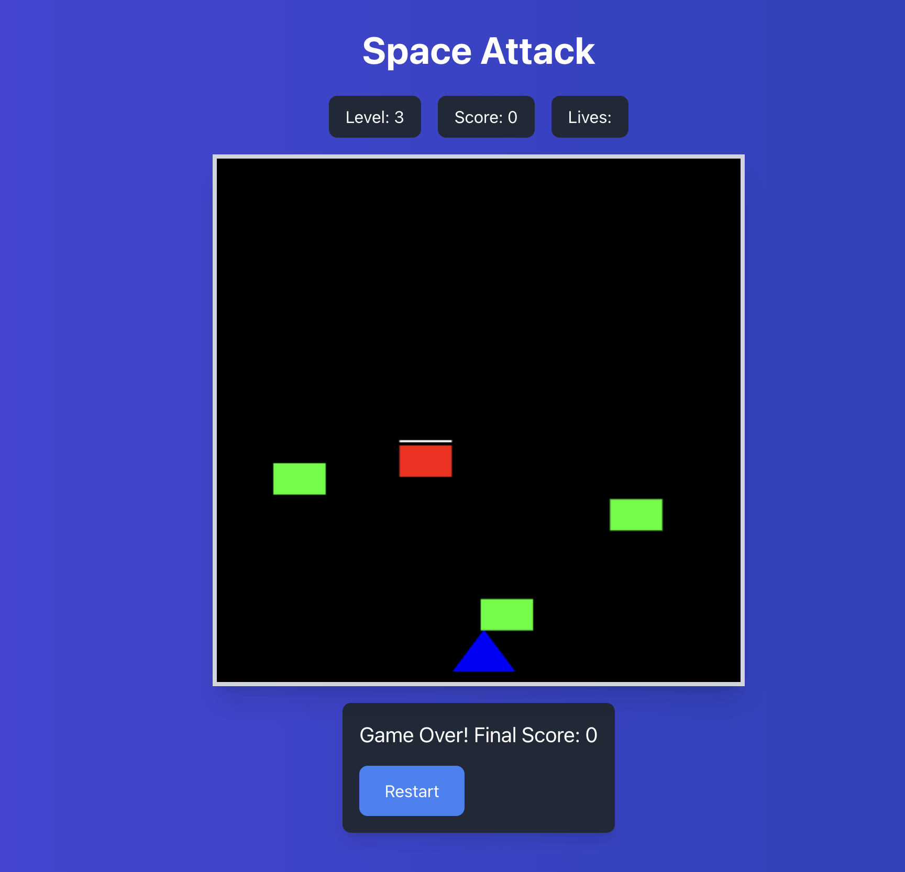

# Space Attack Game

## Overview

Space Attack is a fun, retro-style 2D space shooter game built with React. The game involves controlling a spaceship to shoot down waves of enemies while collecting power-ups to aid your progress. Your goal is to survive as long as possible while defeating enemies and leveling up.

---

## Features

- **Player Movement**: Move the spaceship left or right using the arrow keys.
- **Shooting Mechanism**: Shoot bullets using the spacebar. The rapid-fire power-up gives you faster firing.
- **Enemies**: Different enemy types with varying speeds, health, and points. Includes basic enemies, fast enemies, and tank enemies.
- **Power-ups**: Collect power-ups to gain shields, rapid fire, or extra lives.
- **Game Over and Restart**: The game ends when you lose all your lives. You can restart the game after a game over.
- **Wave Progression**: Enemies get more challenging with each level.

---

## Technologies Used

- **React**: Used for managing the game state and rendering the game interface.
- **Canvas API**: Utilized to draw the game graphics, such as the player, enemies, bullets, and power-ups.
- **Lucide Icons**: Used for displaying power-up icons like shield and rapid fire.

---

## Installation

1. Clone the repository:
    ```bash
    git clone https://github.com/yourusername/space-attack.git
    ```

2. Navigate to the project folder:
    ```bash
    cd space-attack
    ```

3. Install the dependencies:
    ```bash
    npm install
    ```

4. Start the development server:
    ```bash
    npm start
    ```

5. Open the game in your browser by going to `http://localhost:3000`.

---

## Gameplay

1. **Movement**: Use the **left** and **right** arrow keys to move the spaceship.
2. **Shoot**: Press the **spacebar** to shoot bullets. If you collect the rapid fire power-up, you can shoot faster.
3. **Collect Power-ups**: When enemies are defeated, power-ups like shield, rapid fire, or extra life may appear. Move your spaceship to collect them.
4. **Survival**: You have 3 lives at the start. If an enemy collides with your spaceship and you don't have a shield, you lose a life. The game ends when you run out of lives.

---

## Power-ups

1. **Shield**: Provides temporary invincibility. Represented by a cyan shield icon (🛡️).
2. **Rapid Fire**: Allows you to shoot bullets faster. Represented by a purple lightning bolt icon (⚡).
3. **Extra Life**: Grants you an additional life. Represented by a pink heart icon (❤️).

---

## Game Over

- When you lose all your lives, the game will display a "Game Over" screen showing your final score.
- You can restart the game by clicking the restart button.

---

## Game Controls

- **Left Arrow**: Move spaceship to the left.
- **Right Arrow**: Move spaceship to the right.
- **Spacebar**: Shoot bullets.

---

## Screenshots



---

## License

This project is licensed under the MIT License - see the [LICENSE](LICENSE) file for details.

---

## Acknowledgements

- Inspired by classic 2D space shooter games.
- Special thanks to [Lucide Icons](https://lucide.dev/) for the awesome icon set used in the game.

---

Enjoy playing Space Attack!
